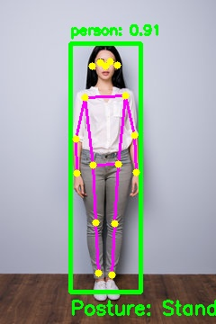

# YOLO Object and Posture Detection System

A computer vision project using YOLOv8 and OpenCV for real-time object detection and human posture classification (Standing, Sitting, Bending).

## � Demo

Here is the system in action:

| Input Image | Detected Output |
|:-----------:|:---------------:|
|  |  |

## 🚀 Quick Start

1.  **Clone the repository**:
    ```bash
    git clone https://github.com/dhruvsoin/Yolo_PostureDetector.git
    cd Yolo_PostureDetector
    ```

2.  **Run with `uv` (recommended)**:
    ```bash
    # Process an image
    uv run python posture_detector.py --input test_images/test.jpg --output output/output.jpg

    # Process a video
    uv run python posture_detector.py --input test_videos/sample.mp4 --output output/result.mp4

    # Run on webcam
    uv run python posture_detector.py --webcam
    ```

## 🎯 Features

*   **Object Detection**: Identifies people and common objects using YOLOv8.
*   **Posture Classification**: Categorizes human poses into **Standing** (Green), **Sitting** (Blue), or **Bending** (Red).
*   **Visual Output**: Draws bounding boxes, keypoint skeletons, and confidence labels.
*   **Multi-mode**: Supports images, videos, and live webcam feeds.

## 🛠️ Usage

### Command Line Arguments

| Argument | Description | Example |
| :--- | :--- | :--- |
| `--input` | Path to image or video file | `--input test.jpg` |
| `--output` | Path to save the result | `--output output.jpg` |
| `--webcam` | Use webcam as input source | `--webcam` |
| `--model` | YOLO model version | `--model yolov8s-pose.pt` |
| `--conf` | Confidence threshold (0-1) | `--conf 0.6` |
| `--show` | Display window during processing | `--show` |

## � Requirements

*   Python 3.8+
*   `uv` (or pip)
*   Key libraries: `ultralytics`, `opencv-python`, `numpy`

```python
# Detailed batch processing example
from pathlib import Path
from posture_detector import PostureDetector

detector = PostureDetector()
for img_path in Path('test_images').glob('*.jpg'):
    detector.process_image(str(img_path), f'output/{img_path.name}', show=False)
```